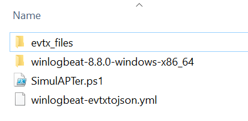

# Files
Files

## LOLDriverScanner All
https://www.loldrivers.io/api/drivers.json

Download the LOLDriverScanner_ALL script and download the drivers.json file (link above, sorry no webrequest included, dont like pwsh talking to internet =] )
Put the drivers.json in LOLDriverScanners root folder and run the script.
This one is more aggressive and will search in whole C: for sys-files. It checks MD5,SHA1,SHA256, Authenticode (SHA256) against the loldrivers json file.

The results will be in console or GridView (excel look-a-like)

## LOLDriverScanner
https://www.loldrivers.io/api/drivers.json

Light variant which is only checking SHA256 AND Authenticode but some loldrivers from the json file dont have these entries and you will likely miss them if
they exist in your system. The paths its checking are also only some specific directories and you will likely miss the ones that are in directories that are not common (application/hardware sys-files in uncommon directories.)

Download the LOLDriverScanner script and download the drivers.json file (link above, sorry no webrequest included, dont like pwsh talking to internet =] )
Correct the path "$loldriversFilePath" in the powershell script to the location of your drivers.json or just simply put the drivers.json in same root folder as LOLDriverscanner script.

Run the script and check the results in console or GridView (excel look-a-like)

Special thanks to:
Oddvar Moe @ Twitter, http://oddvar.moe
for the idea.

### Webrequest support and additional feature with path/file extension changes
@MHaggis at
https://github.com/MHaggis/notes/blob/master/utilities/scan-drivers.ps1

### Living Off The Land Drivers
Living Off The Land Drivers is a curated list of Windows drivers used by adversaries to bypass security controls and carry out attacks. The project helps security professionals stay informed and mitigate potential threats.
https://www.loldrivers.io/api/drivers.json

## SimulAPTer
Uses saved EVTX logfiles (from breaches or other simulations) to simulate attacks in your environment by letting the user to specify usernames, hostnames etc. So you can simulate that the events happens in your systems to test alerts/queries and so on. The idea is to have a simulating option without the need to execute any commands in your environment (like other simulations tools).
I have forked some excellent repositories that has MITRE mapped EVTX files, baseline usages etc that you can have as a starting point. Pick and choose by Tactic ID or just grab the ones you need to simulate a sequences of adversary behaviors.
I have put many hours of work of going through several hundreds of EVTX-files and the data inside to find key/values of interest for simulation. 
The work is done but there may be some i could have missed. I have tried to comment the script and winlogbeat-evtxtojson.yml as much as possible.

Modified and added extra feature where simulation occurs by me (Ekitji)

Original script without feature for simulation.
Credits to Grant Sales
[https://gist.github.com/gwsales](https://github.com/gwsales/Winlogbeat-Bulk-Read)

SimulAPTer is a powershell script that uses winlogbeat to parse the evtx files which are later saved in ndjson/json format (depending on winlogbeat version), it then saves all separate ndjson files in to a single file (depending on how many EVTX files that is found in powershell script root folder).

The script asks user for information like:
* Enter the victim username you want to simulate

* Enter the attacker username you want to simulate

* Enter the victim hostname you want to simulate'

* Enter the attacker hostname you want to simulate

* Enter the time you want to simulate

* Enter the root domain name you want to simulate

* Enter the subdomain you want to simulate

The script iterates through the single ndjson file with all events and changes the data with user specified usernames,hostnames etc.
The end user will be informed when script is done

### How to use
Download latest winlogbeat from https://www.elastic.co/downloads/beats/winlogbeat
(latest test with Winlogbeat 8.8.0)

Download the script SimulAPTer.ps1, winlogbeat-evtxtojson.yml and put winlogbeat (unzip downloaded winlogbeat) in same root folder, structure should look like
For example inside C:\Users\Ekitji\Desktop\Simulapter

* winlogbeat-8.8.0-windows-x86_64 (directory which contains winlogbeat.exe)
* SimulAPTer.ps1
* winlogbeat-evtxtojson.yml

Make a new directory in C:\Users\Ekitji\Desktop\Simulapter where you put all your EVTX files you want to parse and simulate, or simply put them in your root folder where the script is located.
The script will check powershell scripts root folder recursively for EVTX-files.
In my example i will create a directory in C:\Users\Ekitji\Desktop\Simulapter and call it evtx_files and put the EVTX files there.

Run the script and answer the popup boxes where you can type what username, hostname etc you want to simulate.

User will be prompted when the parsing and changes are finished.

                                   ALL FILES SAVED                                                    
        For all untouched files   C:\Users\Ekitji\Desktop\Simulapter\converted\allinoneraw.ndjson                                     
        For pretty viewing check  C:\Users\Ekitji\Desktop\Simulapter\converted\alleventspretty.json                                   
        For importing to SIEM check  C:\Users\Ekitji\Desktop\Simulapter\converted\allevents.ndjson                                     
                                   HAPPY HUNTING                                                     

**Supporting SIEMS with upload of ndjson/json**

Elastic Stack, upload in Kibana, max file support default 100mb, changeable to 1GB (1000mb) in advanced settings.
Referens: https://www.elastic.co/blog/importing-csv-and-log-data-into-elasticsearch-with-file-data-visualizer

Splunk, has 500mb file support, last checked May 2022

Other solutions are to use alternative methods to get them in to your SIEM, like the use of a logshipper.

**Sources with EVTX files**

https://github.com/sbousseaden/EVTX-ATTACK-SAMPLES

https://github.com/mdecrevoisier/EVTX-to-MITRE-Attack

https://github.com/Yamato-Security/hayabusa-sample-evtx/tree/main/YamatoSecurity

https://github.com/sans-blue-team/DeepBlueCLI/tree/master/evtx

https://github.com/JPCERTCC/LogonTracer/tree/master/sample

https://github.com/pete-cc/evtx-samples

https://github.com/hrzwtk/MitreAttackEvtx

https://github.com/G4rb3n/Malware-EVTX

https://github.com/NextronSystems/evtx-baseline
- Check the releases.

https://github.com/jymcheong/SysmonResources

**Sources that may need additional work before running them with SimulAPTer**

https://github.com/OTRF/Security-Datasets/tree/master/datasets/atomic/windows

https://github.com/omerbenamram/evtx

https://tryhackme.com/room/windowseventlogs

https://tryhackme.com/room/sysmon hunting mimikatz, malware, metasploit etc.

**Other sources for EVTX files**

Generate them your self or run simulation frameworks and save them
* Atomic Red Team
* Red Team Automation
* Infection Monkey
* PurpleSharp / PurpleAD
* Caldera etc

**Side note**

When specifying a time in script with

"Enter the time you want to simulate"

Your time for when the events occurs can pass into the future scoope because of script adding 1 second for each loop if you have a large amount of EVTX files that you run the script on. It will probably be easier for you if you pick a time some days back in time or atleast some hours before the actual time when running it. It depends also when you are going to upload it to your SIEM solution. Maybe you are just creating the log you want to use for a later use and if so this wont be a problem.

You can check log.file.path when visualizing in your SIEM to get information about which evtx-file caused the event.

The agent.name of the winlogbeat is customizable by changing the value for "Name" in winlogbeat-evtxtojson.yml, 
if you have a empty value, the hostname of the system you run the script with will be used. You can also customize the tags you want.
This information will be included in your parsed evtx files which are saved by winlogbeat as ndjson/json files.

My Selection in my winlogbeat-evtxtojson.yml is

name: "SimulAPTer"

tags: ["SimulAPTer", "simulation", "simulapter"]
